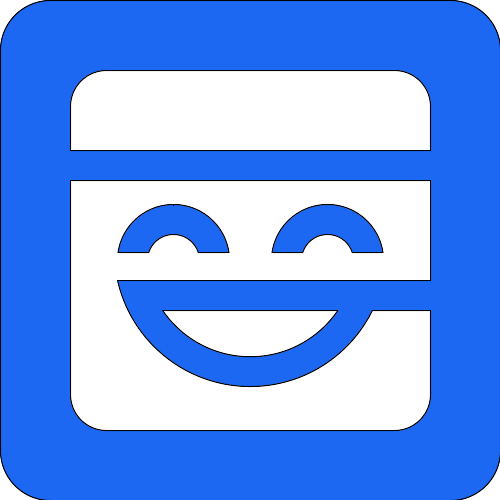

<div align="center">

<h1>Autochessia</h1>
<p>Fully on chain auto chess</p>
</div>

[](https://dev.autochessia.xyz/) [](https://autochessia.xyz)

Autochessia is a auto chess game, but runs fully on chain and write via MUD and solidity. Believing fully on-chain game would brings the next generation UGC paradigm, we make this game and try to make it extensible.

## Preview Demo


## Get Start

Require:

- [pnpm](https://pnpm.io/)
- [foundry](https://getfoundry.sh/)

Install dependencies

```bash
pnpm install
```

config default `.env`

```shell
cp packages/contracts/.env.template packages/contracts/.env
```

run local development and preview

```bash
pnpm dev
```

## Feature

- waiting room and match
- buy, sell and place your hero
- income
- experience
- automatic routing and attack
- support 2 players in a game

## Todo

- [x] SnapSync
- [x] Lobby Matchmaking
- [x] Quit Game
- [x] Multiplayer
- [x] Custom Rooms
- [x] Synergy
- [x] Beginner Guidance
- [ ] Damage Display
- [ ] Synthesis Tips
- [ ] Skills
- [ ] Items
- [ ] Movement Animation Completion
- [ ] Attack Animations
- [ ] Hotkey Controls
- [ ] Full Auto Tick
- [ ] Account Abstraction
- [ ] Neutral Monsters

## Supporters

<picture>
  
</picture>

<picture>
  
</picture>

<picture>
  
</picture>

## License

Proud to be open-source and licensed under [AGPL-3.0](./LICENSE)
